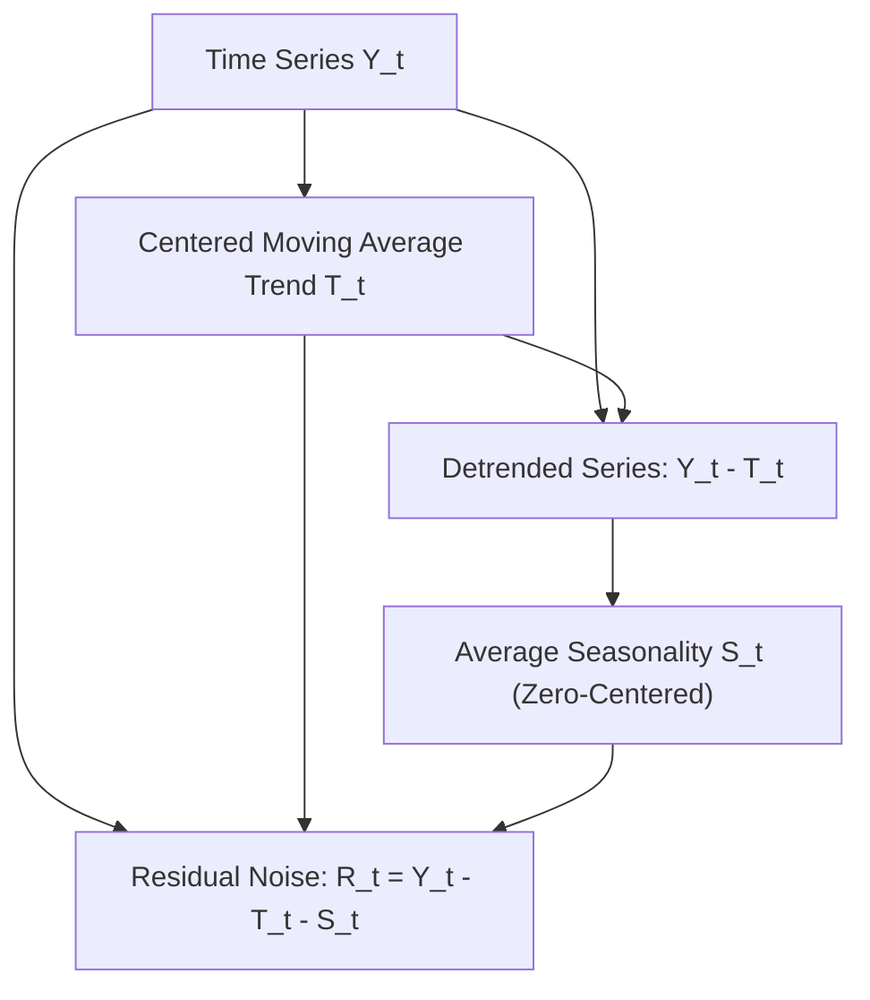

# genpark-seasonal-trend-decomposition-stl-skill

Agent Skill implementing **Classical Additive Time-Series Decomposition** isolating centered moving average Trend ($T_t$), Periodic Seasonality ($S_t$), and Irregular Residuals ($R_t$).

## Architectural Overview

